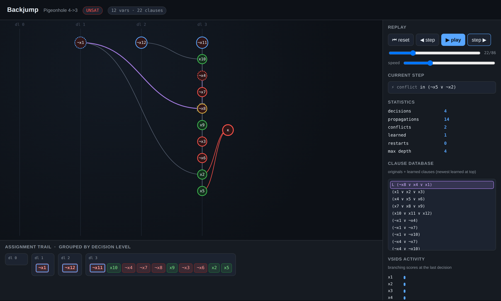

# Backjump

A modern **CDCL SAT solver**, built from scratch in pure Python — with verified
UNSAT proofs, real combinatorial-puzzle encoders, exact model counting, a
differential fuzzer, and an interactive implication-graph **visualizer** that
replays a real solve step by step.

> SAT is the canonical NP-complete problem, and conflict-driven clause learning
> (CDCL) is the algorithm that made it practical. Backjump implements the whole
> machine — two-watched-literal propagation, 1-UIP clause learning,
> non-chronological backjumping, VSIDS, restarts — and then makes its answers
> *trustworthy* (independently checked proofs) and *legible* (you can watch the
> implication graph grow and the conflict get analysed).



## What it is
Give Backjump a Boolean formula in CNF and it decides **SAT** (with a satisfying
assignment) or **UNSAT** (with a machine-checkable refutation). It also encodes
real problems — Sudoku, N-Queens, graph colouring, pigeonhole — into CNF, solves
them, and decodes the answer back.

Everything is the standard library only. No `pip install`, no dependencies. The
visualizer is a single self-contained HTML file.

## Quick start
```bash
python3 bj.py demo                 # guided tour of every feature (~2s)
bash demo.sh                       # tests + demo + phase transition + fuzz

python3 bj.py sudoku               # solve the built-in hard Sudoku
python3 bj.py queens 30            # 30-queens
python3 bj.py color 3 --cycle 5    # 3-colour a 5-cycle (2 colours is UNSAT)
python3 bj.py pigeon 7 6           # UNSAT, with a verified proof
python3 bj.py count --vars 8 --clauses 16 --check   # exact #SAT vs brute force
python3 bj.py fuzz --trials 2000   # differential test against brute force
python3 bj.py phase                # the 3-SAT satisfiability cliff (~4.26)

# generate and open an interactive visualizer:
python3 bj.py viz pigeon --pigeons 4 --holes 3 --out php.html
python3 bj.py solve formula.cnf --viz solve.html
```
Run the tests:
```bash
python3 -m unittest discover -s tests      # 42 tests
```

## Features

### Required
1. **CDCL core.** DIMACS parser → solver with two-watched-literal unit
   propagation, **1-UIP** conflict analysis and clause learning,
   **non-chronological backjumping**, **VSIDS** branching (indexed binary heap
   with activity decay + rescale), phase saving, and **Luby restarts**. Returns
   SAT with a model or UNSAT.
2. **Verified answers.** SAT models are checked clause-by-clause. UNSAT answers
   ship a **DRUP-style proof** (the learned clauses in derivation order, ending
   in the empty clause); an *independent* RUP checker — sharing no code with the
   solver — re-derives the contradiction. A wrong "UNSAT" cannot pass.
3. **Problem encoders + decoders.** Sudoku (4×4/9×9/…), N-Queens, graph
   *k*-colouring, and pigeonhole → real CNF → solve → decode to a filled grid /
   queen placement / colour assignment. No special-case puzzle logic.
4. **Interactive visualizer.** A generated, dependency-free single HTML file that
   **replays an actual recorded solve**: the decision trail grouped by level, the
   implication graph, the **κ conflict node**, the **1-UIP cut** and the learned
   clause, VSIDS activity bars, restart markers, and full statistics — step,
   play, scrub, or arrow-key through it.

### Stretch (all implemented)
5. **CLI + statistics + DIMACS I/O.** Ten subcommands; decisions / propagations /
   conflicts / learned / restarts / max-depth stats; read and write DIMACS.
6. **Differential fuzzer + phase transition.** Thousands of random instances
   cross-checked against an independent brute-force oracle (and every UNSAT proof
   re-verified); a `phase` demo that renders the random-3-SAT satisfiability cliff
   near clause/variable ratio ≈ 4.26.
7. **Exact model counting / AllSAT** (`count`) via blocking clauses, cross-checked
   against brute force.

## How it works
```
DIMACS ─► CNF ─► [ normalise: dedup lits, drop tautologies ]
                      │
                      ▼
        ┌─────────────────────────────┐
        │  CDCL: trail + decision levels
        │  • propagate (2 watched lits)
        │  • conflict ─► analyze (1-UIP) ─► learned clause
        │  • backjump (non-chronological)
        │  • VSIDS pick + decay  • Luby restarts
        └─────────────────────────────┘
            │SAT                  │UNSAT
            ▼                     ▼
      model verifier        RUP proof checker  (independent)
            │                     │
   encoders ⇄ decoders     trace recorder ─► embedded JSON ─► HTML visualizer
```
The solver is **deterministic**: identical input ⇒ identical decisions every run,
so any behaviour is reproducible.

### Layout
```
bj.py                  CLI entry point
backjump/
  cnf.py               CNF type + DIMACS parse/write
  solver.py            the CDCL solver, VSIDS heap, Luby, trace recorder
  proof.py             independent model + RUP/DRUP proof checking
  encoders.py          Sudoku / N-Queens / colouring / pigeonhole
  brute.py             brute-force oracle + exact #SAT
  modelcount.py        AllSAT / #SAT via blocking clauses
  viz.py               self-contained HTML visualizer generator
  cli.py               subcommands + argument parsing
tests/test_backjump.py 42 tests
examples/*.html        pre-generated visualizers
demo.sh                end-to-end driver
```

## Verification
- **24,000+ random instances** across all fuzz runs agree with a brute-force
  oracle — zero disagreements; every SAT model and every UNSAT proof independently
  verified.
- Encoders validated against problem semantics (a solved Sudoku is a legal
  completion; no two queens attack; colourings are proper; PHP(p, p−1) is UNSAT
  with a checked proof).
- The visualizer's replay logic is tested in Python *and* the embedded JavaScript
  is syntax-checked, with a node harness confirming SAT replays reconstruct a
  satisfying assignment and UNSAT replays terminate correctly.

## Why I built this today
Earlier daily builds covered databases, consensus, regex/automata, autodiff,
physics and procedural generation — but nothing in **combinatorial search**. CDCL
is one of the most beautiful and consequential algorithms in CS, and almost all of
its cleverness (backjumping, 1-UIP learning, watched literals, VSIDS) is invisible
in a normal solver. Making it *correct*, *self-certifying*, and *watchable* in one
day was exactly the right size of hard.

## Where a human could take this next
- **Faster proof checking.** The RUP checker is quadratic; a watched-literal
  forward DRAT checker (with deletion lines) would scale to large refutations.
- **Clause-database reduction** (LBD/glue-based deletion) and **inprocessing**
  (subsumption, vivification) to handle industrial instances.
- **Learned-clause minimisation** (self-subsuming resolution) to shrink learned
  clauses and the proof.
- **Incremental solving under assumptions** (`solve(assumptions)`), the API that
  powers bounded model checking and MaxSAT.
- **Richer encodings**: cardinality/PB constraints (totaliser, sequential
  counter), and an Optilog-style MaxSAT layer on top.
- **A WASM build** of the solver so the visualizer can solve live in the browser
  instead of replaying a recorded trace.

## License
Built as an autonomous daily build. Use it however you like.
