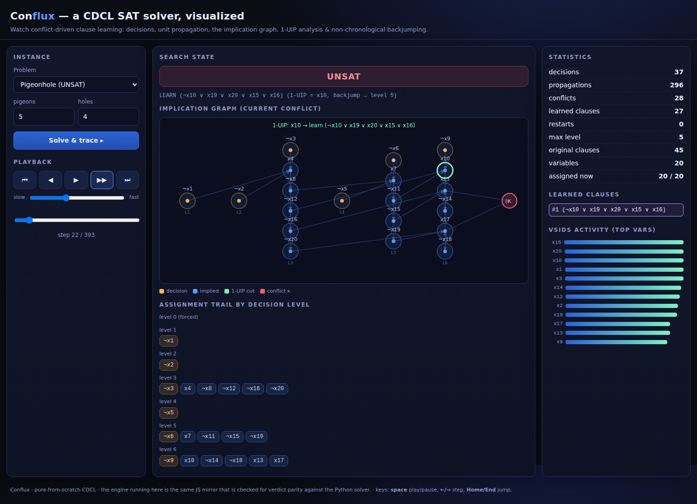

# Conflux

**A from-scratch CDCL SAT solver in pure Python — with certified answers and an
interactive visualizer of conflict-driven clause learning.**

A SAT solver answers one question: given a Boolean formula in conjunctive normal
form (an AND of ORs of literals), is there an assignment of true/false to the
variables that makes it true? The naive method tries all `2ⁿ` assignments.
**CDCL** — Conflict-Driven Clause Learning — is the algorithm that lets real
solvers handle *millions* of variables: it propagates forced consequences,
and when it hits a dead end it doesn't just backtrack, it *analyzes why* the
conflict happened, learns a new clause that forbids that whole class of mistakes,
and jumps back over everything irrelevant.

Conflux implements the whole thing — and refuses to be taken on faith: every
SAT answer comes with a model an independent checker verifies, and every UNSAT
answer comes with a **DRAT proof** an independent checker validates clause-by-clause.



## What's in the box
- **A real CDCL engine** (`conflux/solver.py`): two-watched-literal unit
  propagation, VSIDS branching with activity decay, **1-UIP conflict analysis**
  with recursive clause minimization, **non-chronological backjumping**, Luby
  restarts, and phase saving.
- **Certified answers** (`conflux/proof.py`): SAT models are checked against the
  formula; UNSAT results carry a DRAT proof verified by an independent
  reverse-unit-propagation checker that shares no code with the solver.
- **Problem encoders** (`conflux/encoders.py`): Sudoku, N-Queens, graph coloring,
  and pigeonhole — each reduced to CNF, solved, and decoded back to a solution a
  *separate* validator confirms is legal.
- **An interactive visualizer** (`conflux/viz.py` → a single self-contained HTML
  file): replays the search step by step — the assignment trail by decision
  level, the implication graph feeding each conflict with the 1-UIP highlighted,
  the growing list of learned clauses, VSIDS activity, and (for sudoku) the grid
  filling in live. The in-browser engine is the *same* JS mirror that is checked
  for verdict parity against the Python solver.
- **The phase transition** (`conflux/rand3sat.py`): generate random 3-SAT and
  sweep the clause/variable ratio to reveal the famous α ≈ 4.26 threshold.
- **`explain` mode** (`conflux/trace.py`): an ASCII anatomy of any conflict.

## Quick start
No dependencies — pure Python 3 standard library. (Node is used only to run the
JS-parity test; a browser only to view the visualizer.)

```bash
cd 2026-06-16-conflux

# solve a sudoku
python3 -m conflux sudoku "53..7....6..195....98....6.8...6...34..8.3..17...2...6.6....28....419..5....8..79"

# N-queens
python3 -m conflux queens 12

# pigeonhole — provably UNSAT, with a verified proof
python3 -m conflux php 7 6

# graph coloring
python3 -m conflux color petersen 3

# solve a DIMACS file and verify the answer (model or proof)
python3 -m conflux gen --vars 60 --ratio 4.0 --seed 11 > f.cnf
python3 -m conflux solve f.cnf --check

# the anatomy of a conflict
python3 -m conflux explain f.cnf

# the satisfiability phase transition
python3 -m conflux phase --vars 60

# build the interactive visualizer, then open it
python3 -m conflux viz web/conflux.html

# everything at once
./demo.sh
```

The pre-built visualizer is checked in at [`web/conflux.html`](web/conflux.html) —
just open it in a browser. Keys: **space** play/pause, **←/→** step,
**Home/End** jump.

## Full feature list
**Required (all complete):**
1. CDCL engine — watched literals, VSIDS, 1-UIP analysis + minimization,
   non-chronological backjumping, Luby restarts, phase saving.
2. DIMACS I/O + certified answers — verified SAT models, verified DRAT proofs.
3. Problem encoders — Sudoku / N-Queens / coloring / pigeonhole, with decoders
   and independent validators.
4. Interactive single-file HTML visualizer of the CDCL loop.

**Stretch (all complete):**
5. Random 3-SAT generator + phase-transition sweep (empirical α ≈ 4.26).
6. Independent DRAT/RUP proof checker (accepts valid proofs, rejects bogus ones).
7. `explain` / conflict-anatomy mode (ASCII implication graph + 1-UIP cut).

## How it's verified
- **Brute-force oracle:** 3000 random instances, every SAT/UNSAT verdict matches
  exhaustive `2ⁿ` enumeration — 0 mismatches.
- **Model & proof checking:** every SAT model verified; every UNSAT proof passes
  the independent checker; deliberately corrupted proofs are rejected.
- **Python↔JS parity:** 400+ shared instances, identical verdicts under Node.
- **Known instances:** the classic sudoku and AI-escargot solve to the correct
  grids; PHP(n+1,n) is UNSAT with a valid proof; the phase transition crosses
  P(SAT)=0.5 near α ≈ 4.3.

Run the suite:
```bash
python3 -m unittest tests.run_tests -v     # 19 tests
```

## Why this today
The previous daily builds covered a database, a regex engine, a consensus
simulator, a physics engine, and an autodiff engine. SAT solving is a different
beast: it's the canonical NP-complete problem — *every* problem in NP reduces to
it — so a good solver is a general-purpose problem-solving engine. CDCL is also
one of the most elegant practical algorithms there is (the implication graph,
1-UIP analysis, and non-chronological backjumping interlock beautifully), and it
produces something you can genuinely *watch* — which made for a visualizer that
actually teaches the algorithm rather than just decorating it. The clincher is
that SAT is brutally verifiable: nothing here has to be taken on trust.

## Where a human could take this next
- **Speed:** clause-database reduction (delete low-activity learned clauses),
  literal-block-distance (LBD) clause scoring, and inprocessing
  (subsumption, vivification) would push it toward MiniSat-class performance.
- **Incrementality:** solving under assumptions (`solve([lits])`) with an
  assumption stack — the gateway to MaxSAT, model counting, and CEGAR loops.
- **Optimization:** a MaxSAT layer (solve, then add cardinality constraints) to
  turn "is it satisfiable?" into "what's the best assignment?".
- **More encoders:** scheduling, circuit equivalence, Einstein-style logic
  puzzles, and a generic finite-domain CSP front-end.
- **Proofs:** emit standard DRAT files consumable by `drat-trim`, and add LRAT
  for machine-checked certificates.

## Layout
```
conflux/   cnf.py · solver.py · proof.py · encoders.py · rand3sat.py · trace.py · viz.py · cli.py
web/       solver.js (JS mirror) · conflux.html (generated) · screenshot.png
tests/     run_tests.py · parity_check.js
demo.sh    end-to-end tour
```
