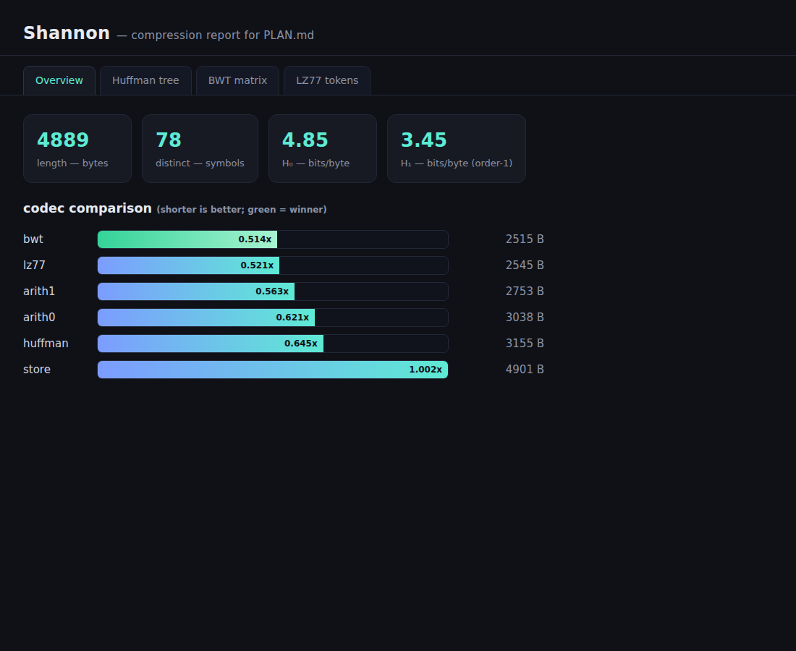
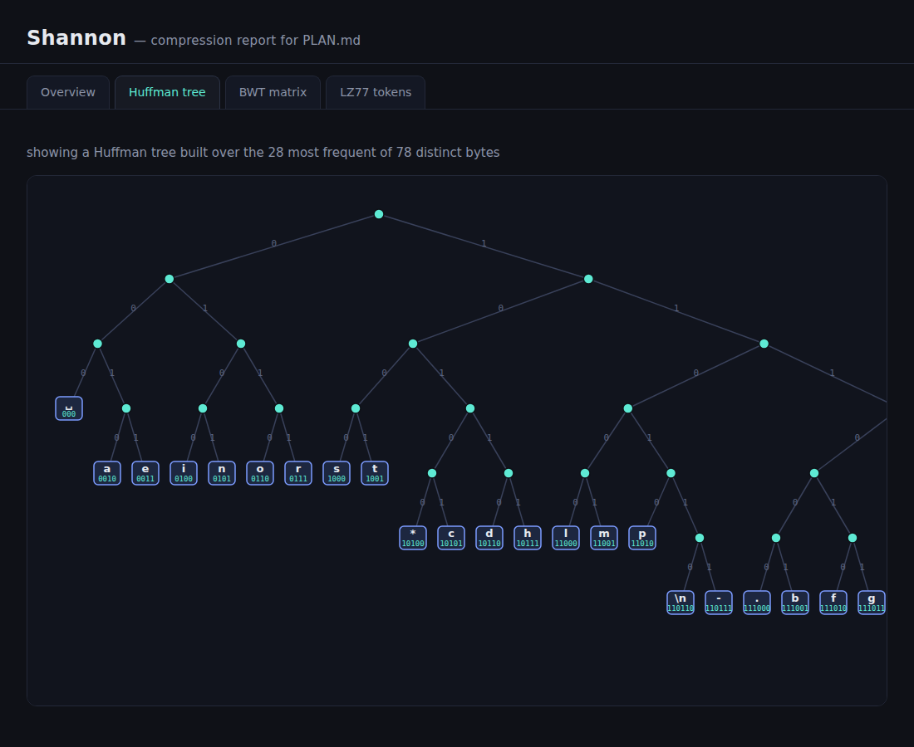
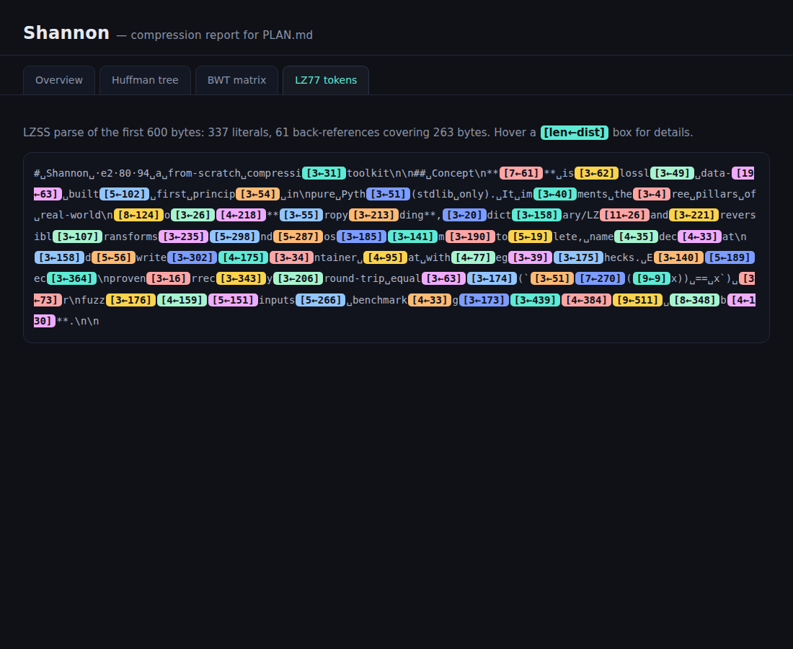

# Shannon

A from-scratch lossless **data-compression toolkit** in pure Python (stdlib only).

> **Status:** Phase 5 (VERIFICATION) complete — 28-test suite (round-trips,
> Kraft equality, entropy-bound, BWT/MTF/RLE, corruption/bomb rejection, CLI)
> all green, plus `shannon demo` and `./demo.sh` exercise every feature
> end-to-end. See [PLAN.md](PLAN.md) and [REVIEW.md](REVIEW.md).





## Quick start
```sh
python3 cli.py compress PLAN.md --best      # smallest of all codecs -> PLAN.md.shz
python3 cli.py info       PLAN.md.shz        # codec, sizes, ratio, integrity
python3 cli.py decompress PLAN.md.shz -o out # restores the original, byte-identical
```
Codecs: `store`, `huffman`, `arith0`, `arith1` (order-1 arithmetic), `lz77`
(deflate-lite), `bwt` (bzip-lite: BWT→MTF→RLE→Huffman).

Shannon implements the three pillars of real compressors — entropy coding
(Huffman + arithmetic), dictionary coding (LZ77/LZSS), and reversible transforms
(Burrows–Wheeler + MTF + RLE) — and composes them into named codecs over a real
`.shz` container format with CRC self-verification. Correctness is proven by
round-trip equality and measured against the Shannon entropy bound.

Build phases (per the daily-build process):
1. ✅ **Plan** — concept, architecture, ≥6 features.
2. ⬜ Core build — Huffman, arithmetic coder, LZ77, BWT pipeline.
3. ⬜ Adversarial review + fixes.
4. ⬜ Stretch (entropy report, HTML viz) + polish.
5. ⬜ Verification suite.
6. ⬜ Ship.
