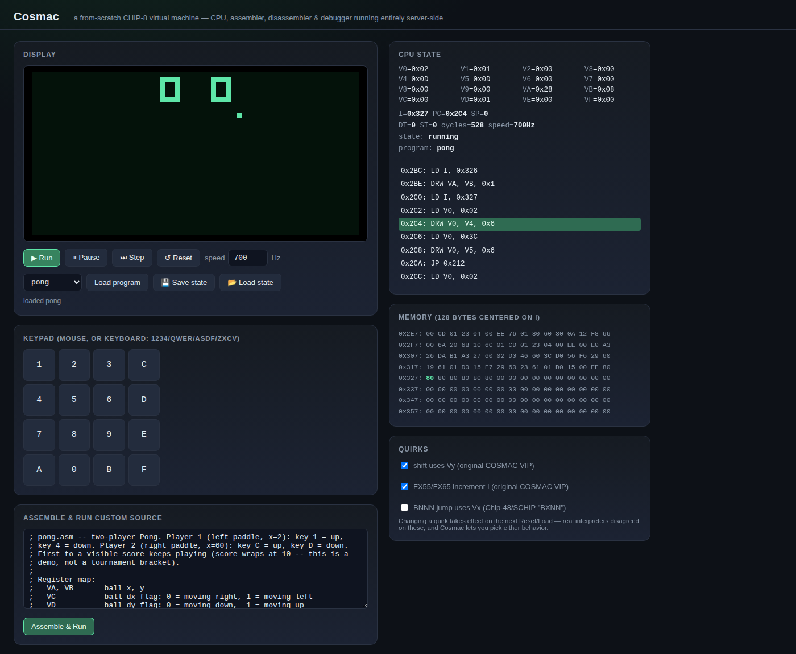

# Cosmac

A CHIP-8 virtual machine built entirely from scratch — CPU emulator, its own
two-pass assembler and disassembler, an interactive debugger (CLI + a
server-backed browser front end), and five original CHIP-8 programs written
in Cosmac's own assembly dialect. See [PLAN.md](PLAN.md) for the full design
rationale.

**Status: shipped.** All four required features work end-to-end: CPU core,
assembler, disassembler + debugger, and a live browser UI running real
programs. See [REVIEW.md](REVIEW.md) for the adversarial pass — 7 real bugs
found and fixed. Three stretch features are shipped: **save states**,
**configurable quirks** (with a UI toggle), and **real audio** — a
from-scratch square-wave WAV encoder (`cosmac/wav.py`) renders a program's
actual sound-timer activity to a playable `.wav`, and the browser plays a
live Web Audio beep off the same signal. 123 unit/integration/UI tests plus
[`demo.py`](demo.py) (a standalone, dependency-free walkthrough exercising
every feature end-to-end) all pass.

## Live UI



Registers, live disassembly (click a line to toggle a breakpoint), a
memory viewer centered on `I`, and quirk toggles, all driven by the same
`Chip8`/`Debugger` objects the CLI and test suite use — nothing in the
browser computes CHIP-8 state itself.

## Quick start

```
cd 2026-07-28-cosmac
python3 -m cosmac.server        # http://127.0.0.1:8880
```

Or drive a program from the terminal debugger:

```
python3 -m cosmac.debugger programs/pong.asm
```

## Run the tests

```
python3 -m unittest discover -s tests
python3 demo.py     # standalone end-to-end walkthrough, no test framework needed
```

(`test_ui.py` needs `pip install playwright`; every other suite, and
`demo.py`, is stdlib-only.)

## Render a program's audio to a real WAV file

```
python3 -m cosmac.wav programs/beep.asm out.wav
```

## What's implemented so far

- `cosmac/cpu.py` — full 35-opcode CHIP-8 interpreter, configurable quirks
  (shift/store-load/jump variants that real interpreters disagreed on),
  save/restore state.
- `cosmac/assembler.py` — two-pass mnemonic assembler (labels, `DB`/`DW`,
  string literals).
- `cosmac/disassembler.py` — bytecode → mnemonic text, lossless round-trip
  with the assembler.
- `cosmac/debugger.py` — breakpoints, step/run, register/memory/disasm
  inspection, a CLI REPL.
- `cosmac/server.py` + `web/index.html` — the CPU runs server-side in a
  background thread; the browser is a thin renderer driven by
  Server-Sent Events (same architecture as this repo's Gambit/Impulse
  builds).
- `programs/` — `ball.asm`, `maze.asm`, `keypad.asm`, `pong.asm`,
  `selftest.asm`, all original, all exercised by the test suite.

Remaining phases (adversarial review, stretch features, polish, final
verification) are next.
