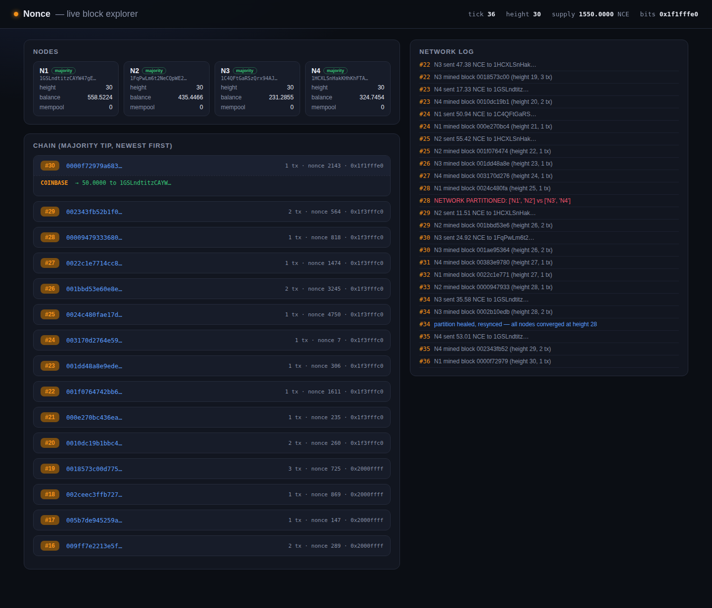

# Nonce

A blockchain / cryptocurrency built entirely from scratch: SHA-256, secp256k1
ECDSA, merkle trees, UTXO transactions, proof-of-work mining, and a
simulated multi-node P2P network reaching Nakamoto consensus.

**Status: Phase 5 — verification complete.** `demo.sh` runs a 100-test
suite plus the full scripted multi-node demo plus a persisted-CLI sanity
pass, end to end, all green. 8 real bugs found and fixed across
adversarial review, live explorer testing, and writing the formal test
suite (see [REVIEW.md](REVIEW.md)) — including one that silently
defeated the merkle tamper-detection check itself, an ECDSA
transaction-malleability gap, two separate block-template selection bugs
that could waste real mining work or drop valid chained transactions, a
missing address-validation check that let a typo silently burn funds,
and a fork-tie-break gap that could leave the network *permanently*
split after a partition healed. All 4 required features work end-to-end
(see [PLAN.md](PLAN.md)):

1. Proof-of-work blockchain core (SHA-256d, adjustable target, real
   nonce-grinding miner).
2. secp256k1 ECDSA wallets + signed UTXO transactions.
3. Merkle-tree transaction commitment + inclusion proofs.
4. A simulated P2P network of independently-validating nodes reaching
   consensus, including fork creation under a network partition and
   automatic reorg-to-heaviest-chain on heal.

Both stretch features are also already working: difficulty retargeting
and a live HTML block explorer (`python3 -m nonce explorer`).

## Try it

```
cd 2026-08-12-nonce
python3 -m nonce wallet              # generate a keypair + address
python3 -m nonce mine --blocks 10    # mine a small isolated chain
python3 -m nonce demo                # full scripted multi-node scenario
python3 -m nonce explorer            # live block explorer at http://127.0.0.1:8420

# a persisted wallet + chain you can genuinely mine/send with across commands:
python3 -m nonce local init
python3 -m nonce local mine --blocks 5
python3 -m nonce local send <address> 1.5
python3 -m nonce local balance
```



```
./demo.sh    # full verification: 100-test suite + scripted demo + persisted-CLI checks
```

Final polish and shipping are next.
