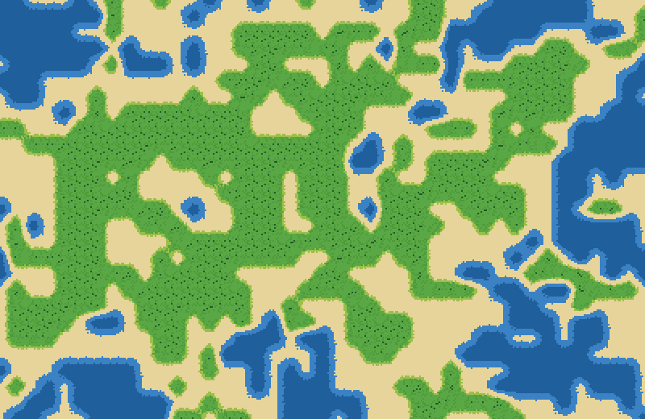
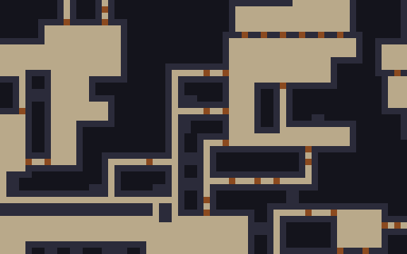
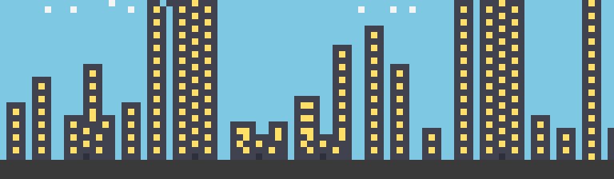
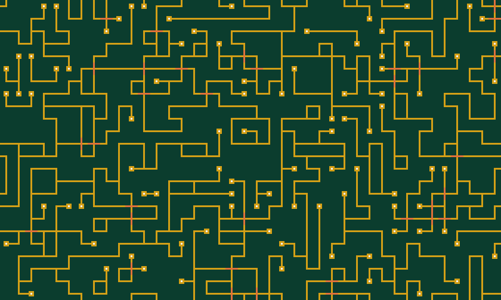

# Mosaic

A from-scratch **Wave Function Collapse** engine in Rust — zero dependencies — with trail-based
**backtracking**. Give it a tiny example image, or a tileset with edge sockets, and it grows an
arbitrarily large output in which every local neighbourhood is guaranteed to look like the input.
Includes its own PNG encoder *and* decoder (LZ77 + Huffman deflate, inflate with dynamic Huffman),
a collapse-animation viewer, an independent output validator and a backtracking-vs-restart benchmark.

| | |
|---|---|
|  |  |
| 81-tile Wang terrain, island pinned in the centre | dungeon learned from a 16x16 sample (8-fold symmetry) |
|  |  |
| skyline with `--ground` anchoring | PCB traces from a rotated tileset |

## How to run
```bash
cargo build --release                  # needs only a Rust toolchain
./demo.sh                              # tests + every feature end to end -> gallery/
target/release/mosaic list

# overlapping model: learn from an example
target/release/mosaic overlap --sample dungeon --size 64x40 --seed 3 --out dungeon.png
target/release/mosaic overlap --sample city --ground --size 96x28 --out city.png
target/release/mosaic overlap --sample waves --wrap-in --wrap-out --size 48x48 --out waves.png
target/release/mosaic overlap --sample my_drawing.png --n 3 --symmetry 8 --wrap-in --out mine.png
target/release/mosaic overlap --sample flowers --pin 8,8,'*' --pin 30,20,o --ascii

# tiled model
target/release/mosaic tiled --set terrain --size 40x26 --pin 20,13,t2222 --out terrain.png
target/release/mosaic tiled --set circuit --size 40x24 --anim circuit.html   # open in a browser

# does backtracking help? (constrained torus)
target/release/mosaic bench overlap --sample wires --n 4 --wrap-in --wrap-out --size 50x50 --trials 12 --restarts 100
cargo test --release                   # 40 tests
```
Run `mosaic --help` for every option. Samples can be built-in names, `.txt` ASCII art (any
character = a colour), `.ppm`, or 8-bit `.png`.

## Features
1. **Generic WFC solver** — wave of boolean possibilities, per-direction support counts, min-entropy observation with noise, weighted collapse, arc-consistency propagation, periodic or bounded grids. Model-agnostic: it only sees weights and a propagator table.
2. **Overlapping model** — NxN pattern extraction, 1–8 fold rotation/reflection augmentation, wrap-around sample option, overlap-agreement adjacency, `--ground` row anchoring, entropy-averaged rendering of partial states.
3. **Tiled model** — tiles with per-side sockets (exact-match and paired `name+`/`name-` sockets), automatic rotation expansion, weights. Built-in `circuit` (18 tiles from 7 base tiles) and `terrain` (81 Wang tiles over 3 corner levels with smooth coasts, procedurally drawn).
4. **Backtracking** — every ban goes on a trail, every decision on a stack; a contradiction undoes to the last decision, forbids the failed choice, and propagates again. A per-attempt budget then falls back to restarting (hybrid). Reports decisions / backtracks / restarts.
5. **Pinned cells** — `--pin x,y,glyph|#rrggbb|tilename`, pins merged (intersected) per cell.
6. **Collapse animation** — self-contained HTML flipbook (base64 PNG frames, scrubber, play/pause); frames are sampled evenly over the real event count so the superposition blur resolving — and backtracks — are visible.
7. **Benchmark** — `bench` compares backtracking vs restart-only over many seeds.
8. **Independent validators** — every output is re-checked by code that does not share the solver's tables (every NxN window must exist in the sample; every shared edge must have matching sockets). CLI exits 1 on any violation.
9. **Own PNG codec** — encoder with Sub filter + LZ77/fixed-Huffman deflate; decoder for stored/fixed/dynamic blocks, five colour types, five filters, CRC checks.
10. **Hardening** — resource limits, one-line errors with exit code 2, deterministic by seed.

## Result worth knowing
On a constrained torus (`wires`, N=4, wrap in/out, 50x50, 12 seeds): backtracking solves 12/12 in **~225 ms**
with 0.25 restarts on average; restart-only solves 12/12 in **~1.5 s** with 36.6 restarts on average. On easy
instances (circuit tiles) the two are identical — no contradictions ever occur. And the review found that *pure*
chronological backtracking can thrash (8 s vs 0.7 s on a dungeon torus), which is why the default is a bounded hybrid.

## Why I chose this today
The ledger is full of simulators, compilers, search and ML; it had no procedural-generation / constraint-
satisfaction project. WFC is a great small system: it looks like art but is really a CSP solver, and the
interesting engineering lives in the details — exact undo of propagation state, entropy bookkeeping, rotation
of socket tables — all of which can be verified rigorously rather than eyeballed.

## Where a human could take this next
* Conflict-directed backjumping or nogood learning instead of chronological backtracking; a smarter heuristic than min-entropy (e.g. dom/wdeg).
* Hierarchical / chunked generation for infinite worlds (solve a window, stitch with pinned borders).
* A tileset file format (JSON + image atlas) and mirror symmetries with auto-detected socket classes.
* 3D (voxel) model, and non-grid topologies (hex, graph, mesh).
* Weighted global constraints (path connectivity, "exactly N of tile X") as extra propagators.
* Live in-browser version (compile to WASM) driving the same solver with the animation as the UI.

## Layout
`src/solver.rs` core · `overlap.rs` · `tiled.rs` + `tilesets.rs` · `samples.rs` · `png.rs` · `anim.rs` ·
`verify.rs` · `app.rs` (shared API) · `main.rs` (CLI) · `tests/` · `demo.sh` · `gallery/` · PLAN.md · REVIEW.md
