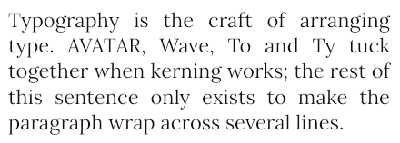
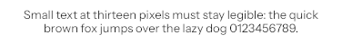
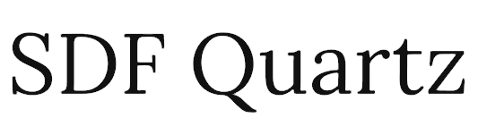

# Glyph — a TrueType font engine, from scratch (Go)

Give it a `.ttf` file; it parses the binary tables, turns characters into outlines,
rasterizes them with exact-area anti-aliasing, lays text out with kerning and wrapping,
and writes PNG / SVG / HTML. **Standard library only** — no font, image-drawing or graphics
packages (`compress/zlib` and `hash/crc32` are used purely as DEFLATE/CRC primitives).

| | |
|---|---|
|  |  |
|  |  |

## Run it
```bash
cd 2026-10-09-glyph
go build -o glyph ./cmd/glyph          # Go 1.24+, no dependencies

./glyph info     testdata/fonts/Lora-Regular.ttf
./glyph text     -font testdata/fonts/Lora-Regular.ttf -size 28 -width 420 -align justify -o out.png "The quick brown fox…"
./glyph glyph    -font testdata/fonts/Lora-Regular.ttf -char g -size 40 -ascii
./glyph svg      -font testdata/fonts/Lora-Italic.ttf -size 48 -o out.svg "Hello, Glyph!"
./glyph lcd      -font testdata/fonts/InstrumentSans-Regular.ttf -size 18 -o lcd.png "Sub-pixel text"
./glyph sdf      -font testdata/fonts/Lora-Regular.ttf -px 48 -spread 8 -size 96 -o atlas.png -demo sdf.png "SDF Quartz"
./glyph subset   -font testdata/fonts/Lora-Regular.ttf -o small.ttf "Hello, Glyph!"
./glyph specimen -font testdata/fonts/Lora-Regular.ttf -o specimen.html

./demo.sh        # drives every feature + the full test suite; artifacts land in ./examples
go test -race ./...   # 69 test functions
./mutants.py     # plants 23 bugs one at a time; the suite must kill every one
```
Text comes from arguments, `-file PATH`, or stdin (`-file -`). Run `./glyph help` for all flags
(`-size -width -align -fg -bg -slant -spacing -line-height -no-kern -no-gamma -samples -pad`).
Four fonts (Lora, Lora Italic, Instrument Sans, JetBrains Mono — all SIL OFL, licences included)
live in `testdata/fonts/`; any glyf-flavoured `.ttf` works.

## Features
**Required**
1. **TTF parser** (`ttf/`) — table directory + per-table and whole-file checksum verification; `head`/`maxp`/`hhea`/`hmtx`/`loca` (short + long); simple glyphs (flag run-lengths, short/same deltas) and **composite glyphs** (XY offsets, scale / x-y scale / 2×2 matrices, `SCALED_COMPONENT_OFFSET`, point matching, depth + component-budget limits); `cmap` formats 0/4/6/12 with validation; `name`; `kern` format 0 and **GPOS PairPos formats 1 & 2** (coverage, class defs, extension lookups, `kern`-feature selection); hmtx left-side-bearing placement. Malformed input returns `ErrMalformed`, never panics or hangs (fuzzed).
2. **Anti-aliased rasterizer** (`raster/`) — adaptive quadratic-Bézier flattening to a stated pixel tolerance (verified against the true curve), implied on-curve points, **true non-zero winding**, exact horizontal span coverage × 32 sub-scanlines, quarter-pixel glyph positioning.
3. **Text layout** (`layout/`) — cmap + advances + kerning, greedy line breaking at spaces and hyphens, hard-splitting over-wide words, left / center / right / **justify**, line-height, letter-spacing, tabs, `.notdef` fallback, control-character handling.
4. **Output + CLI** (`img/`, `render/`, `cmd/glyph/`) — own PNG encoder (all five adaptive filters, CRC, gray/RGB/RGBA), gamma-correct (linear-light) blending, exact-curve SVG export, canvases sized from real ink extents (no clipping), one-line errors with exit code 1.

**Stretch (all shipped)**
5. **SDF atlas** — exact signed distance fields, shelf-packed atlas PNG + JSON (bearings, advances, kerning), and a text renderer that draws at any scale from the atlas alone.
6. **Font writer / subsetter** — `ttf.Build` writes a valid TTF (cmap 4 + 12, flag-compressed glyf, kern, name, OS/2, checksums); `Font.Subset` shrinks a 134 KB font to ~3 KB and keeps kerning.
7. **LCD sub-pixel rendering** — 3× horizontal sampling + FreeType's 5-tap FIR (impulse response tested exactly).
8. **HTML specimen** — size ladder, kerned-vs-plain pairs, glyph grid with baseline / ascender / advance guides, light + dark themes.

## How it was verified
* **Property tests with independent oracles** — rendered coverage integrates to the area measured by brute-force point sampling (different algorithm), over glyphs of every bundled font; flattening stays within tolerance of the *true* Bézier; PNGs decode with the stdlib decoder; `ttf.Build` → `ttf.Parse` round-trips; subset glyphs/advances/kerning equal the original's.
* **Hand-assembled binary fixtures** for things real fonts rarely exercise: composite transforms and point matching, cmap 0/4-rangeOffset/6/12, GPOS format 1/2/extension, hostile cmap ranges.
* **Fuzzing** — hundreds of truncated / bit-flipped / header-smashed fonts per run: no panics, no hangs.
* **Mutation check** (`mutants.py`) — 23 planted bugs (winding rule, delta signs, idDelta, kern sign, PNG filter, blend weights…), 23 killed. Its first run found two blind spots (LCD filter symmetry, justification measured from a self-reported width); the tests were strengthened until nothing survived.
* **Adversarial review** — [REVIEW.md](REVIEW.md): 9 findings (unbounded cmap enumeration, unbounded bitmaps, clipped ink, data race, cross-stream kerning, ignored lsb…) all fixed with regression tests. The `Build` round-trip test found a 10th: the writer silently wrapped glyph deltas > int16.

## Why I built this today
Nothing in this repo touches text: every earlier renderer drew shapes or scenes, none read a font. A font engine is a satisfying mix — fiddly binary formats, a classic graphics algorithm, and correctness that can be *measured* (area integrals, round-trips) rather than eyeballed. And at the end you can read your own words on screen, drawn from raw outline points, which is a hard feeling to beat.

## Limits (honest list)
No GSUB (so `fi` is two glyphs, no ligatures/contextual forms), no mark positioning, no bidi or complex-script shaping, no TrueType hinting (unhinted grayscale AA), no CFF/OpenType-PostScript or `.ttc`, GPOS script/language selection ignored (all `kern` lookups apply), variable-font axes ignored.

## Where a human could take this next
* **Shaping**: GSUB `liga`/`calt`/`ccmp` and GPOS mark attachment, then a tiny Arabic/Indic shaper — the layout package already has the item/pen-position seam for it.
* **CFF / OpenType-PostScript**: a Type 2 charstring interpreter would open the other half of the font world; the rasterizer is outline-agnostic.
* **Hinting or auto-hinting**: a TrueType bytecode interpreter, or a FreeType-style autohinter for crisp stems at 9–12 px.
* **Variable fonts** (`fvar`/`gvar`/`avar`): interpolate outlines along axes — a natural fit for the existing `Outline.Transform` machinery.
* **GPU path**: feed the SDF atlas + JSON straight into a WebGL/wgpu text shader (the metrics are already engine-shaped).
* **Performance**: scanline fill is O(edges × samples) per row; an active-edge table and SIMD-style span accumulation would make large sizes much faster.

## Layout
```
ttf/       parser, cmap, glyf/composites, kern+GPOS, writer/subsetter
raster/    flatten, non-zero scanline filler, LCD filter, signed distance fields
layout/    shaping-lite: advances, kerning, wrapping, alignment
img/       PNG encoder, RGB canvas with linear-light blending
render/    text → canvas, SVG, SDF atlas, HTML specimen
cmd/glyph/ CLI + end-to-end CLI tests
testdata/fonts/  four OFL fonts (licences included)   examples/  demo output
```
